# PODMAN Installation in Windows 

Here you can see the tutorial to install **Podman Desktop** in Windows.

## Step 1:

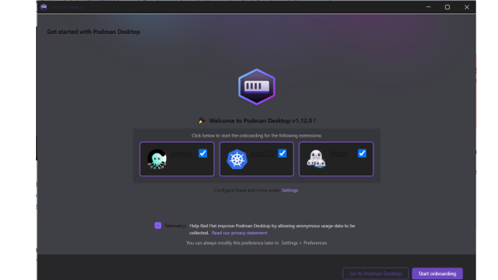

## Step 2:

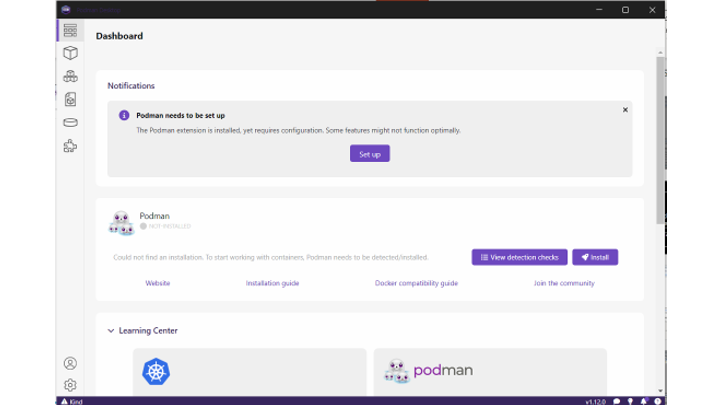

## Step 3:

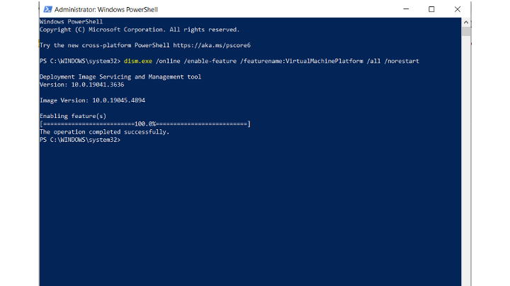

## Step 4:

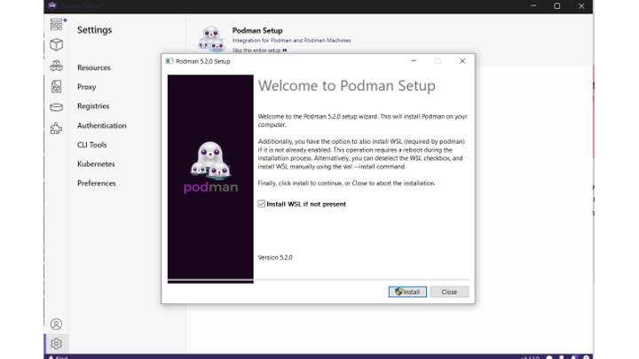

## Step 5:

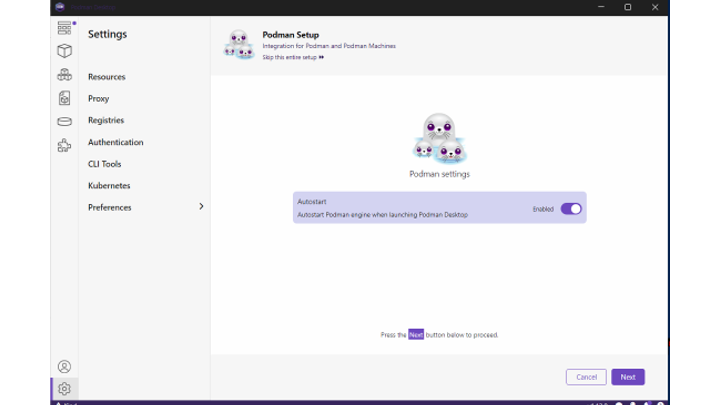

## Step 6:

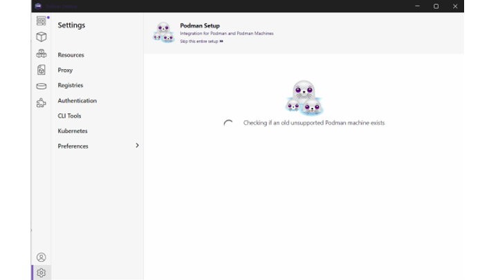

## Step 7:

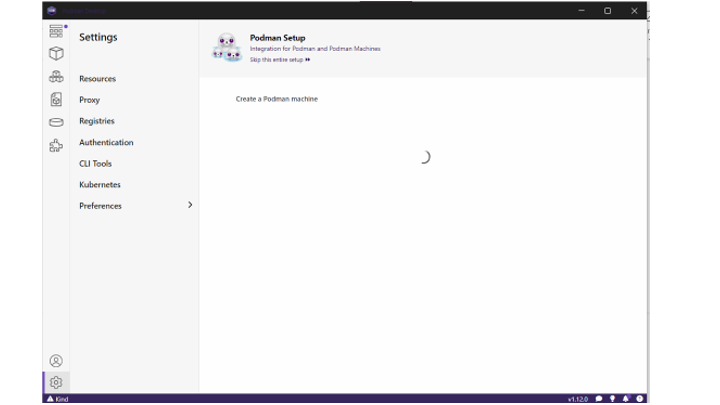

## Step 8:

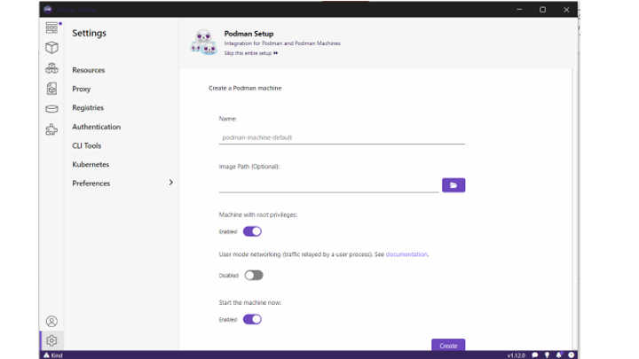

## Step 9:

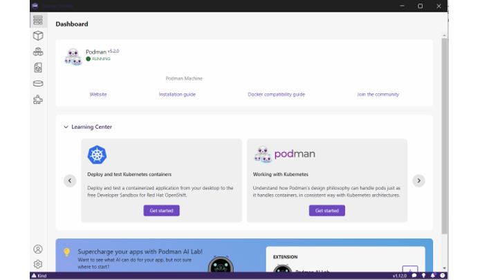

## Step 10:

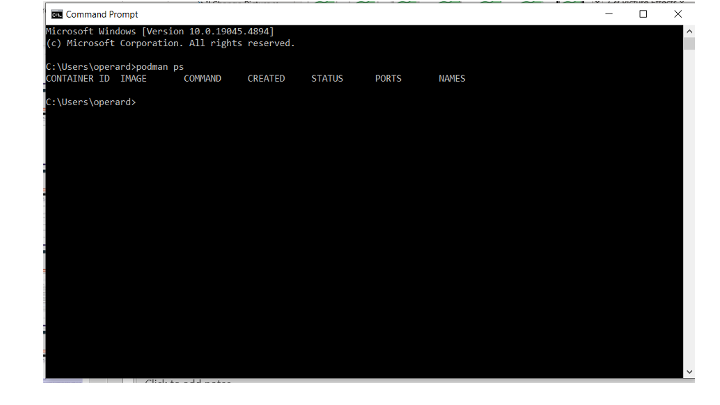

## Step 11:

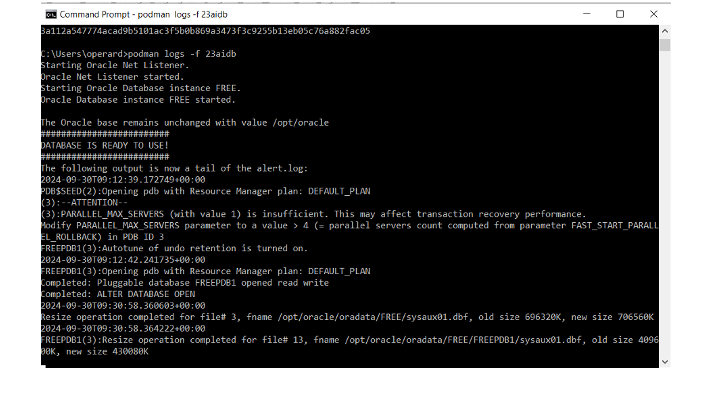

## Step 12:

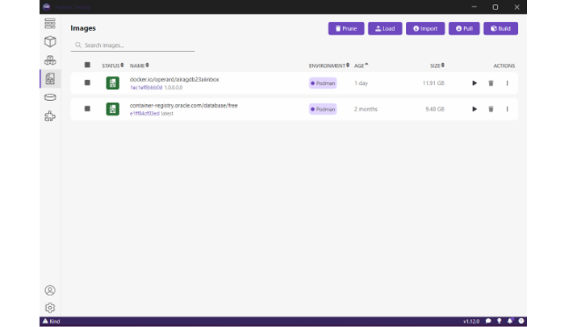

## Step 13:

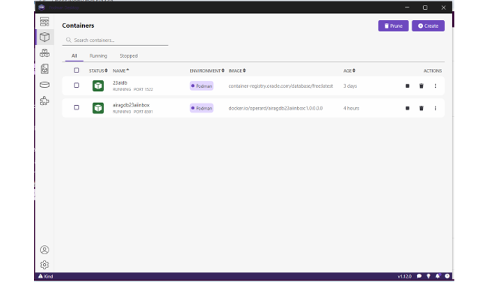

